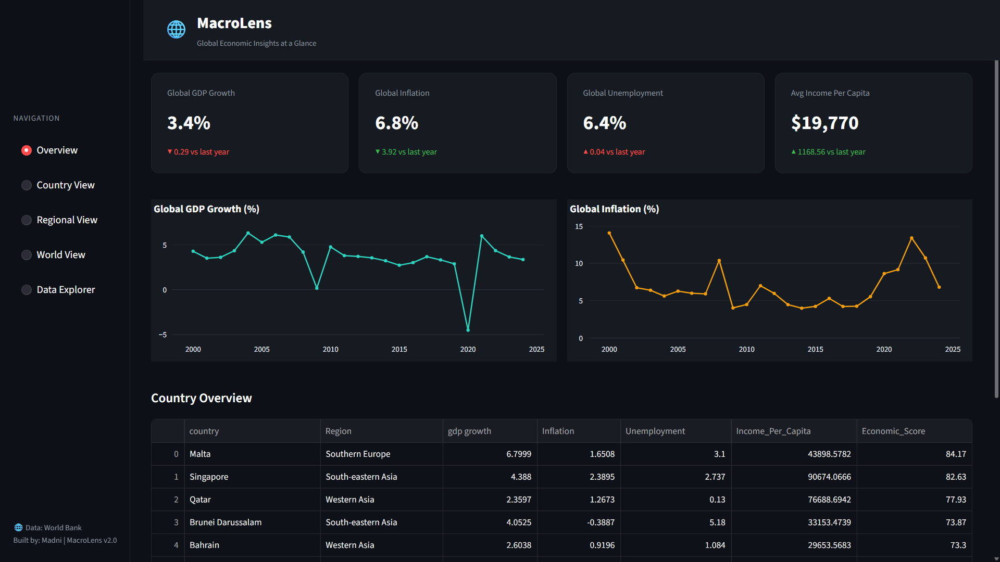
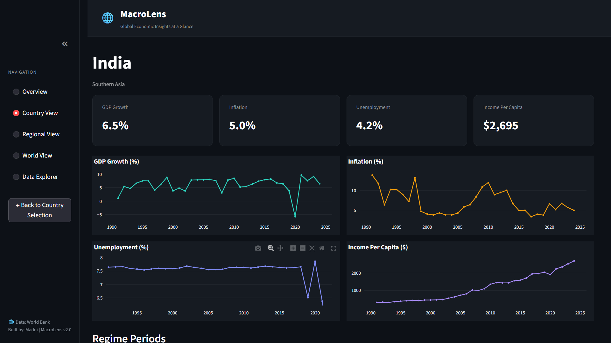

# 🌐 MacroLens
**Multi-country economic data pipeline with an interactive Streamlit dashboard — powered by World Bank datasets.**

    

---

## About

MacroLens is an end-to-end economic data pipeline that ingests annual World Bank datasets across 130+ countries, reshapes and merges them into a unified dataset, and surfaces insights through an interactive Streamlit dashboard.

The pipeline goes beyond simple charting — it computes derived economic signals for every country-year pair: an **Economic Score**, a **Regime classification**, an **economic Condition label**, **Contradiction detection**, and a **rolling GDP forecast**. These are all pre-computed and cached on first run, so the dashboard stays fast.

Built to demonstrate end-to-end data engineering: raw CSV ingestion → cleaning → feature engineering → interactive visual output.

---

## Screenshots


*Overview — global GDP growth, inflation, unemployment, and income per capita with year-over-year deltas*


*Country View — full economic profile for India showing all 4 indicator trend lines and Regime Periods*

---

## Features

- **Data pipeline** — Merges 4 World Bank CSVs, reshapes wide → long, handles missing values and non-country aggregates
- **130+ countries** — Annual coverage across all major and emerging economies
- **Smart caching** — Heavy computation runs once and saves to `processed_cache.csv`; subsequent runs load instantly
- **Economic Score** — Composite percentile-ranked score per country per year (weighted: income 35%, GDP 25%, unemployment 20%, inflation 20%)
- **Condition labels** — Rule-based classification: Recession Signal, Stagflation Risk, Inflation Risk, Healthy Growth, Stable, and more
- **Regime classification** — Expansion / Transition / Recovery / Crisis based on score trajectory
- **Contradiction detection** — Flags anomalies like Jobless Growth or Growth with High Inflation
- **GDP forecast** — 3-year rolling mean as a momentum-based trend signal
- **Streamlit dashboard** — Five views: Overview, Country View, Regional View, World View, Data Explorer
- **Interactive Plotly charts** — Dark-themed, all charts built with Plotly for hover, zoom, and filter

---

## Dashboard Views

| View | What it shows |
|---|---|
| **Overview** | Global averages for all 4 indicators with year-over-year deltas, global trend lines, and a full country table sorted by Economic Score |
| **Country View** | Full economic profile for any country — 4 indicator trend lines, latest metrics, and a Regime Periods table |
| **Regional View** | Horizontal bar chart ranking all countries in a region by Economic Score for a selected year, plus a country-vs-regional-average comparison panel |
| **World View** | Top 10 and Bottom 10 economies by Economic Score for any year, and a GDP Growth vs Inflation scatter plot |
| **Data Explorer** | Browse countries, years, function documentation, data sources, and the raw dataset |

---

## Project Architecture

```
4× CSV files (World Bank)
        │
        ▼
data_pipeline.py     ← Load, reshape wide→long, merge, feature engineering, cache
        │
        ▼
functions.py         ← Economic Score, Condition, Regime, Contradiction, Insight logic
        │
        ▼
web_presentetion.py  ← Full Streamlit dashboard (5 views, Plotly charts)
        │
     main.py         ← Entry point — auto-launches the dashboard
```

---

## File Structure

| File | Purpose |
|---|---|
| `src/main.py` | Entry point — runs the Streamlit dashboard via subprocess |
| `src/data_pipeline.py` | Loads all 4 CSVs, reshapes wide → long, merges, computes all derived columns, writes cache |
| `src/functions.py` | All analytical logic: Economic Score, Condition, Contradiction, Regime, Insight, ranking functions |
| `src/web_presentetion.py` | Full Streamlit dashboard UI with 5 navigation sections |
| `src/report_genrator.py` | Chart and output generation utilities |
| `data-file/` | Raw World Bank CSV files (4 datasets) + `processed_cache.csv` (auto-generated) |

---

## Derived Columns (computed by the pipeline)

| Column | Description |
|---|---|
| `Region` | UN region, mapped via `country_converter` |
| `Unemployment_Change` | Year-over-year change in unemployment per country |
| `Economic_Score` | Composite percentile-ranked score (0–100) |
| `Condition` | Rule-based economic health label |
| `Contradiction` | Detects anomalies in indicator combinations |
| `Insight` | Human-readable summary combining condition, contradiction, and score |
| `GDP_Predicted` | 3-year rolling mean of GDP growth as a trend signal |
| `Condition_checker` | Validates that condition labels are internally consistent |
| `Regime` | Expansion / Transition / Recovery / Crisis classification |

---

## Datasets

All datasets are sourced from the [World Bank Open Data](https://data.worldbank.org/) portal. Downloaded in wide format (years as columns) and reshaped to long format during the pipeline.

| # | Indicator | Source |
|---|---|---|
| 1 | GDP Growth (annual %) | World Bank |
| 2 | Inflation (CPI, annual %) | World Bank |
| 3 | Unemployment (% of labor force) | World Bank |
| 4 | GNI per Capita (current USD) | World Bank |

---

## Requirements

```
Python 3.8+
pandas
streamlit
plotly
country_converter
```

Install dependencies:

```bash
pip install pandas streamlit plotly country_converter
```

---

## Getting Started

```bash
# 1. Clone the repo
git clone https://github.com/heyy-madni/MacroLens.git
cd MacroLens

# 2. Install dependencies
pip install pandas streamlit plotly country_converter

# 3. Run the project
cd src
python main.py
```

Running `python main.py` automatically launches the Streamlit dashboard in your browser.

**First run:** The pipeline will process all 4 CSVs and compute derived columns — this takes a minute. The result is saved to `data-file/processed_cache.csv`.

**Subsequent runs:** The cache is loaded directly, so startup is near-instant.

---

## Data Limitations & Known Issues

- **India unemployment anomaly** — The unemployment chart shows a sharp spike around 2020 followed by a sustained drop. This is a data quality artifact, not a real economic signal. India's large informal economy (daily wage workers, farmers, street vendors) is poorly captured by formal unemployment metrics. The flat line from 1991–2019 also reflects inconsistent World Bank data collection for developing economies, not genuine stability.

- **Informal economies underrepresented** — Unemployment figures for countries with large informal sectors (much of South Asia, Sub-Saharan Africa) should be interpreted with caution. The World Bank data reflects formal labor force surveys, which miss a significant portion of actual economic activity.

- **Non-country aggregates filtered** — The raw World Bank CSVs include regional and income-group aggregates (e.g. "South Asia", "Upper middle income"). These are filtered out during the pipeline so only sovereign countries are included in analysis and rankings.

- **Missing data handling** — Rows with missing values across all 4 indicators are dropped. Countries with sparse historical coverage may appear only for recent years.

- **Hyperinflation outliers** — The World View scatter plot filters out countries with inflation above 40% and GDP crashes below -20% to keep the chart readable. These countries exist in the dataset but are excluded from that view only.

---

*Data sourced from the World Bank Open Data portal · Built with Python, Pandas, Streamlit & Plotly · by [heyy-madni](https://github.com/heyy-madni)*